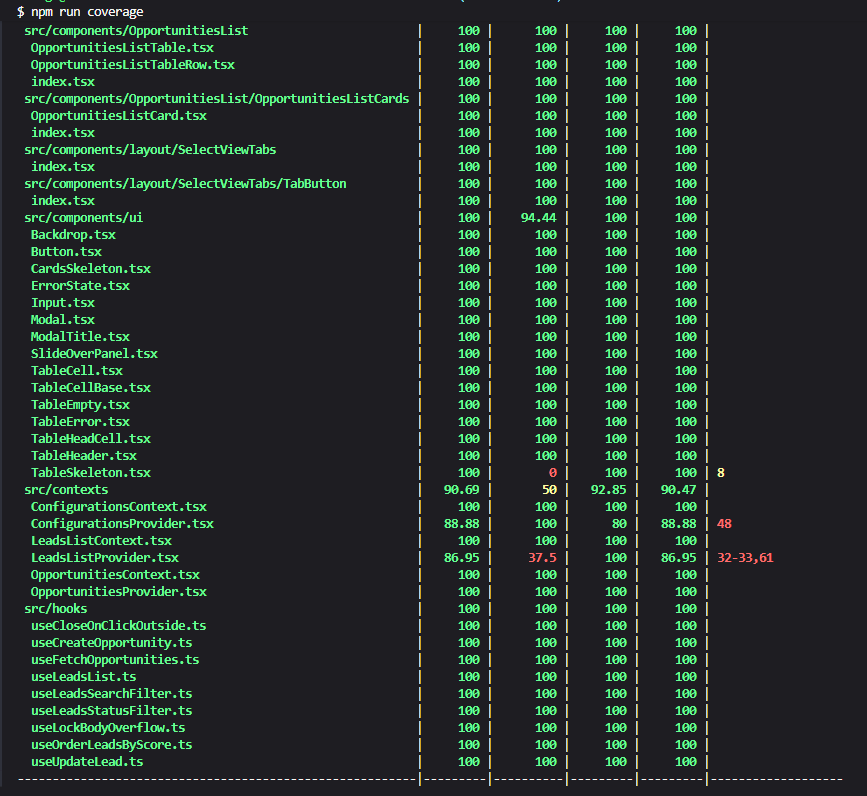
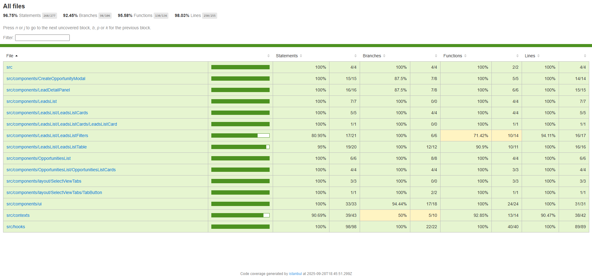

# Mini Seller Console (React + Tailwind)

**Portfolio Project – Mini Seller Console**

> This project showcases frontend engineering skills and is intended for portfolio demonstration only.

## Overview

Mini Seller Console is a lightweight frontend application for managing Leads and converting them into Opportunities. Built with **React (Vite)**, **TypeScript**, and **Tailwind CSS**, it uses a local JSON file as its data source.

A live demo is available at [mini-seller-console.thiagotolotti.com](https://mini-seller-console.thiagotolotti.com/).

## Tech Stack

- React (Vite)
- TypeScript
- Tailwind CSS
- Vitest (unit testing)
- React Testing Library

## Features

- **Leads Management**

  - Load leads from a local JSON file
  - UI states: loading, empty, and error
  - Filter leads by name, company, or status
  - Sort leads by score
  - Edit lead details (in-memory)
  - Convert leads to opportunities (in-memory)
  - Persist filters and sorting in local storage

- **Opportunities Management**

  - Load opportunities from a local JSON file
  - UI states: loading, empty, and error

- **General**
  - Responsive UI with Tailwind CSS
  - Continuous deployment (CD) to Amazon S3
  - Global setting to simulate request errors
  - Unit tests with ~90% coverage using Vitest and React Testing Library

## Getting Started

1. **Install dependencies:**

   ```bash
   npm install
   ```

2. **Start the development server:**

   ```bash
   npm run dev
   ```

3. **Open** [http://localhost:5173](http://localhost:5173) **in your browser.**

## Running Tests and Coverage

1. **Install dependencies:**

   ```bash
   npm install
   ```

2. **Run coverage:**

   ```bash
   npm run coverage
   ```

3. **View the coverage report:**
   - In the CLI output
   - Or open the HTML report:
     ```bash
     ./coverage/index.html
     ```

<table>
	<thead>
		<th>Coverage Report (CLI View)</th>
		<th>Coverage Report (Browser View)</th>
	</thead>
	<tr>
		<td style="vertical-align:top; text-align:center;">
			
		</td>
		<td style="vertical-align:top; text-align:center;">
			
		</td>
	</tr>
</table>
